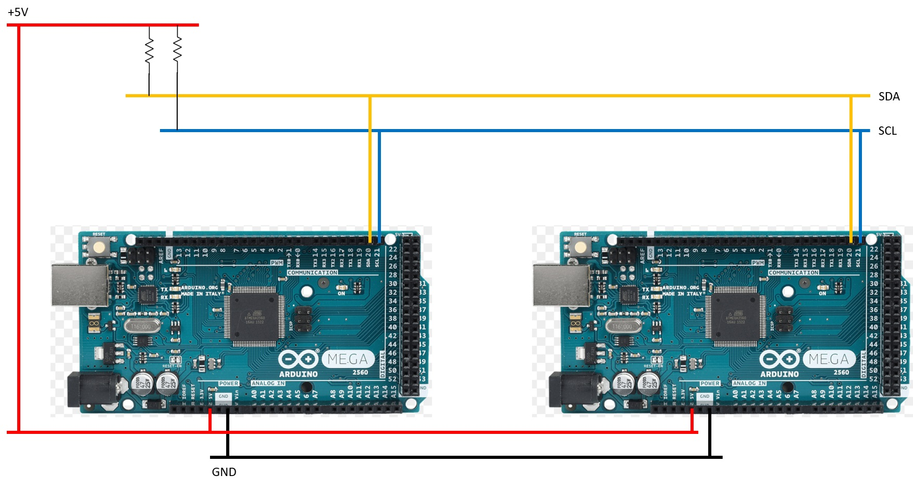
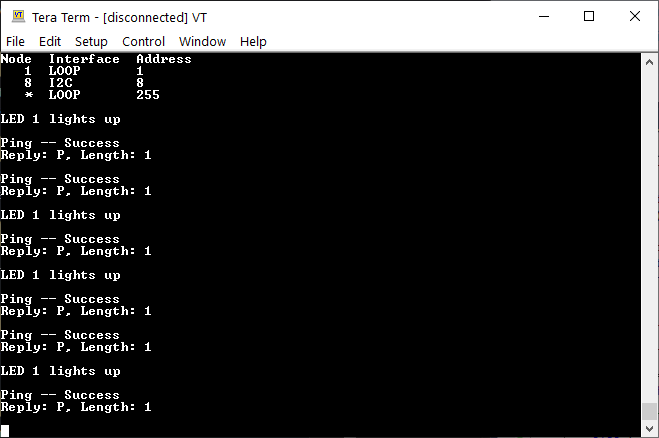
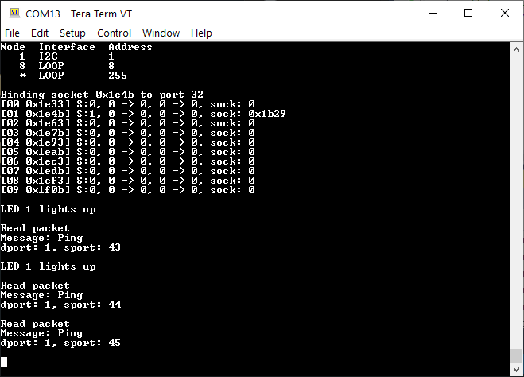

# TT&C 8-bit AVR Test Program

This repo contains test program that simulates an Subsystem receiver node using the CubeSat Space Protocol (CSP).

The program has 2 FreeRTOS tasks - one simulates a background task to light up an LED and the other receives CSP packets.

On top of these 2 FreeRTOS tasks inherited, for the TT&C module, it is assumed that there is a HC-12 connected to the UART2 interface of the Arduino Mega. On receiving the tet `hello`, it will print out to the stdout screen that it has received a message.


## About Test Programs' Setup

The diagram below shows the how the OBC and Subsystem interacts by the CSP protocol.

```
+---------------+                                   +---------------+
|               |                 CSP               |               |
|      OBC      |-----------------------------------|   Subsystem   |
|               |               I2C Bus             |               |
+---------------+                                   +---------------+
     Addr: 1                                             Addr: 8     
```

The OBC will have a CSP address of 1, while the Subsystem will have a CSP address of 8.

The OBC will establish a socket connection to the Subsystem via the subsystem's CSP address and send the Subsystem data packets to specific ports when it wishes to initiate a communication.

In response, the Subsystem will set up a socket to listen to any incoming connections or data packets from any other subsystems (i.e. the OBC here).

## Expected Output

The following diagram shows the expected output when running both the OBC and Subsystem test programs, while connecting the two hardware subsystems via an I2C bus protocol.

Wiring:



OBC output: 



Subsystem output: 


